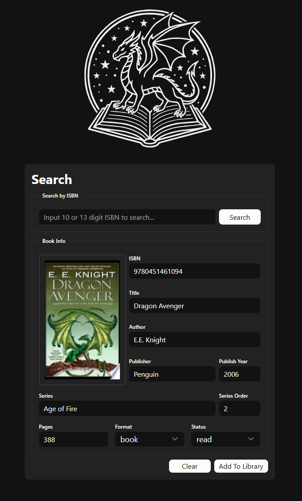

## LibraDraconis
 
Libra Draconis is actively in development for creating a self-hosted database for physical books. The current primary goal is to utilize ISBN to search for book information in publicly available free APIs, populate the data, and allow for any edits before storing safely in the local Postgres database. This project was originally written in Python ([AutoHoard-ISBNLookup](https://github.com/DragonOfTheRoseMoon/AutoHoard-ISBNLookup)) but is being expanded upon and rewritten to be a self-hosted, containerized web app.
 
### Tech Stack
- **Frontend:** SvelteKit
- **Backend:** TypeScript
- **Database:** PostgreSQL / Drizzle ORM
- **Infra / Hosting:** Docker (End Goal)

### Completed
- /search page front end and forms display
- GoogleBooksAPI requests from search bar
- POST endpoint in backend server for Postgres Database insert of book data from search results via Drizzle ORM. 

### Current Progress
- In progress: API response handling & Image local saving by uuid

### Future Steps
- Add additional APIs' results to choose from
- Present the Postgres database of books like a shelf
- Implement a wish list feature that displays as an ordered list
- Package into a Docker image

## Screenshots

